# Interactive ConceptGraphs: An Adaptable Hybrid Framework for Robust Semantic Mapping and Interaction

This repository contains the code for the Interactive ConceptGraphs project.

<!-- [**Project Page**]() |
[**Paper**]() |
[**ArXiv**]() |
[**Video**]() -->

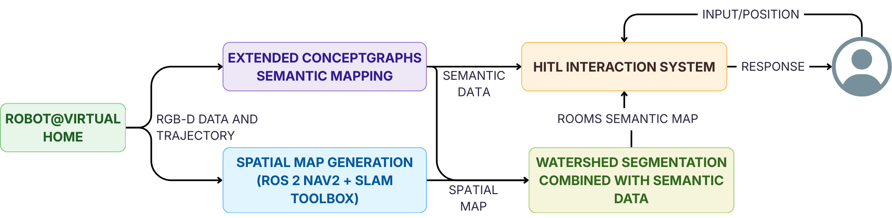
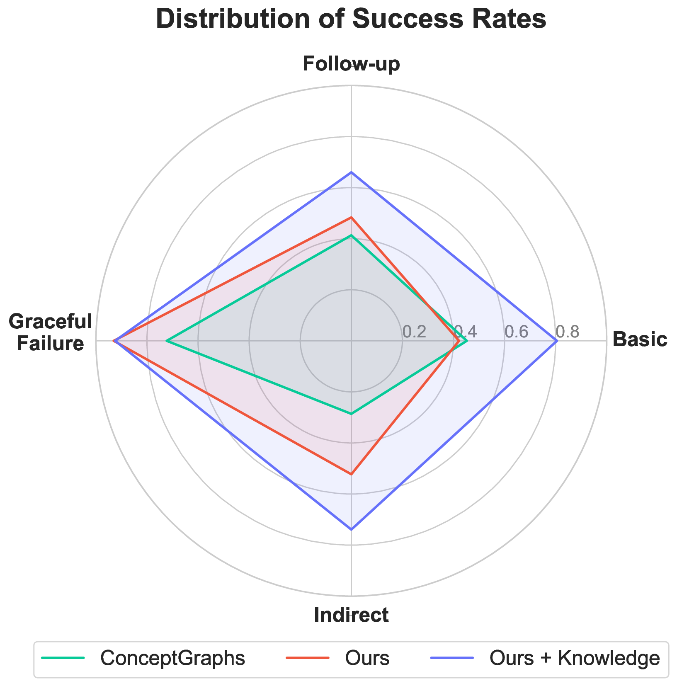


## Article Summary

**Interactive ConceptGraphs** introduces a robust, adaptable framework for semantic mapping and human-in-the-loop (HITL) interaction in robotics. Building on the ConceptGraphs foundation, this work addresses key challenges in semantic mapping—such as high false-positive rates, lack of spatial context, and operational fragility due to reliance on cloud-based models—by integrating several novel components:

- **False-positive filtering routines**: Heuristic-based filters significantly reduce erroneous object detections, improving map precision.
- **Semantic room segmentation**: A watershed-based algorithm, combined with semantic data, segments environments into functional regions (e.g., kitchen, living room), providing spatial context for detected objects.
- **Adaptable hybrid inference mechanism**: The system dynamically switches between local and cloud-based models, ensuring robust operation even under network instability and reducing operational costs.
- **HITL RAG-based agentic interaction system**: A Retrieval-Augmented Generation (RAG) approach enables complex natural language queries and allows users to add knowledge at runtime, leveraging a vector database for efficient semantic retrieval.

The framework was validated on the Robot@VirtualHome dataset (30 simulated homes), demonstrating an 86% reduction in false positives (precision increased from ~0.28 to ~0.68), improved interaction success rates (from ~0.48 to ~0.81), and significant operational cost savings (up to 84%). The system also proved resilient to network failures, maintaining functionality via local fallback models.

---

## Framework Diagrams

### 1. Overall System Architecture

*The architecture processes RGB-D and trajectory data through semantic mapping and spatial mapping pipelines. Semantic and room-segmented maps are integrated into the HITL RAG-based interaction system, enabling context-aware responses to user queries.*

---

### 2. Room Segmentation Routine

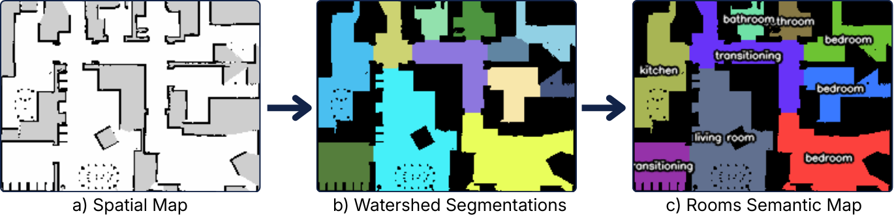

*Room segmentation involves generating a 2D occupancy grid, applying a watershed algorithm for geometric segmentation, and assigning semantic labels (e.g., "kitchen", "bedroom") to each region based on agent trajectory data.*

---

### 3. Semantic Mapping Pipeline and HITL RAG-based Interaction System

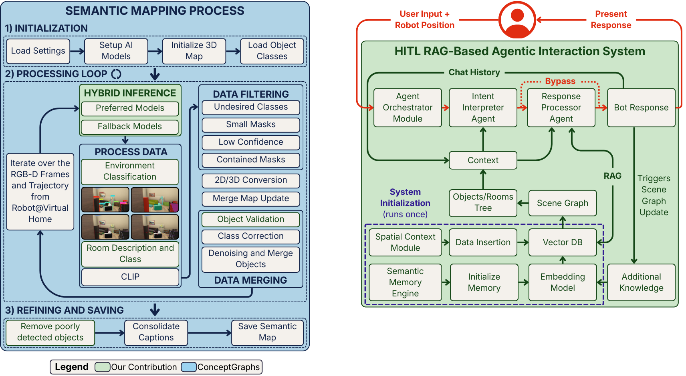

*The extended ConceptGraphs pipeline initializes models, processes data with a hybrid inference mechanism, applies filtering and merging, and refines the semantic map. New contributions (in green) include adaptable inference, environment/room classification, and advanced filtering.*

*The interaction system features two main flows: system initialization and user interaction. User queries are processed by LLM agents, with new knowledge integrated into the vector database and scene graph.*

---

#### Interaction and Memory Initialization Sequences

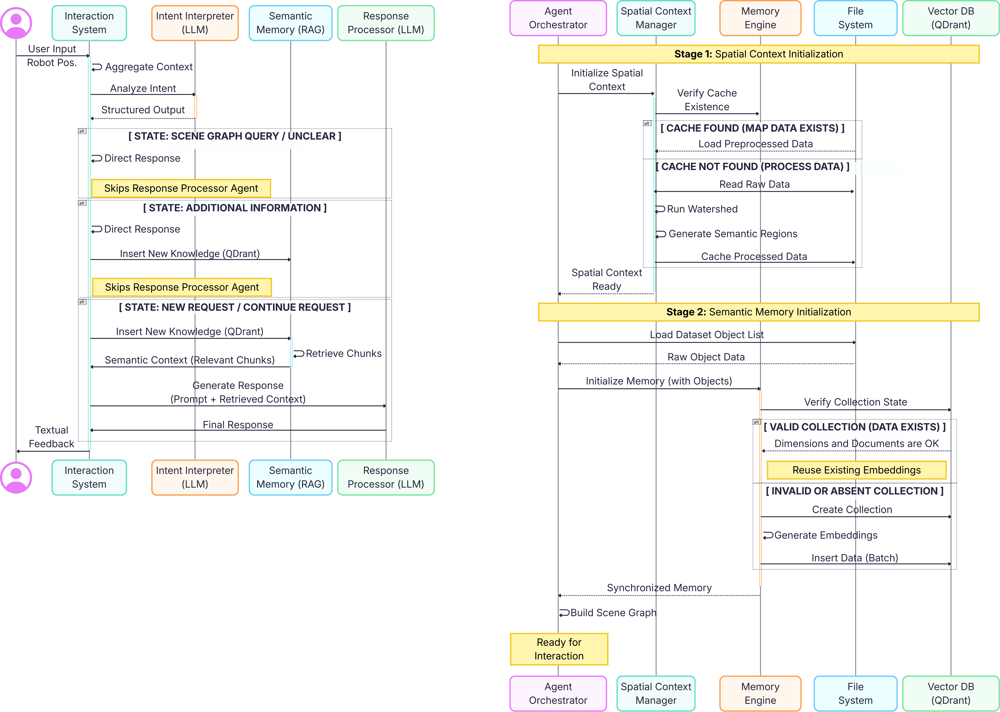

*User queries, combined with robot position, are classified and routed to appropriate agents for response or knowledge insertion.*

*The system checks and prepares the vector database, ensuring all detected objects are embedded and indexed for efficient retrieval.*

---

## Results Overview

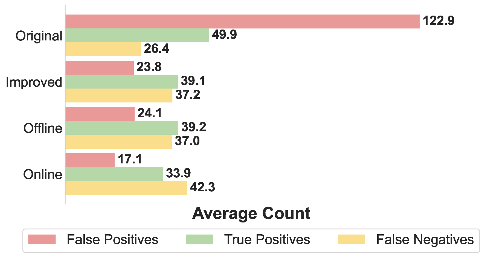
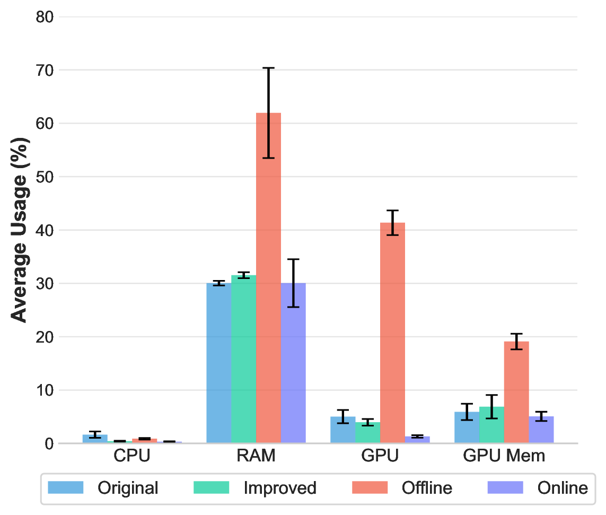
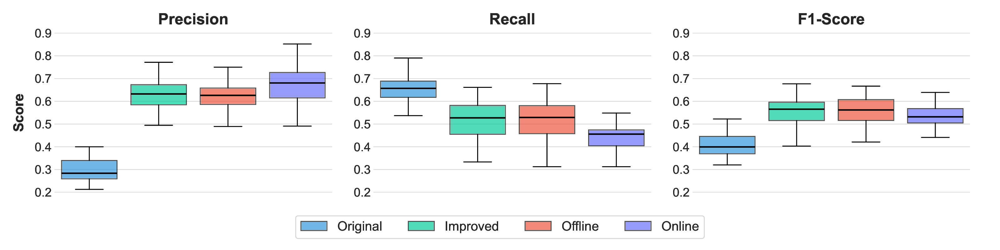

- **Mapping Performance**:  
    - *Precision* improved from ~0.28 (Original) to ~0.68 (Online), with an 86% reduction in false positives.
    - *Recall* decreased slightly due to stricter filtering, but overall F1-score improved.
    - *Operational Cost* dropped by up to 84% with hybrid/local profiles.


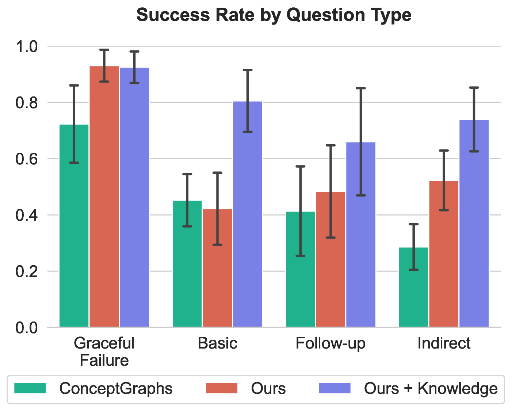
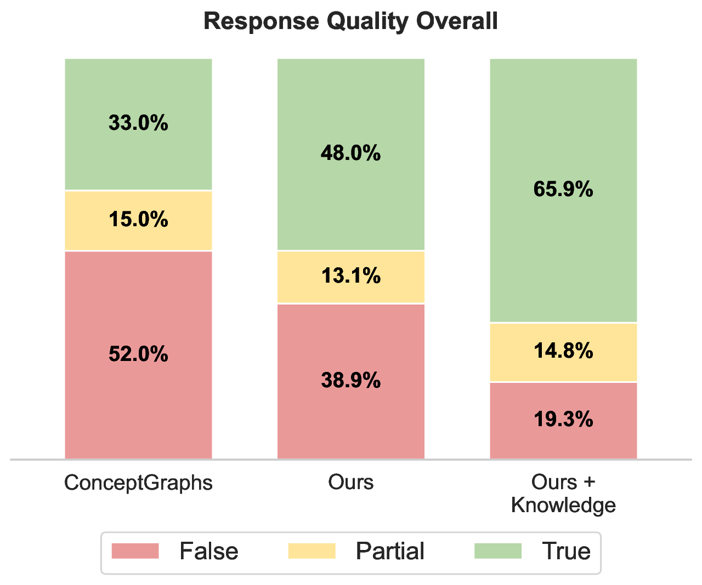
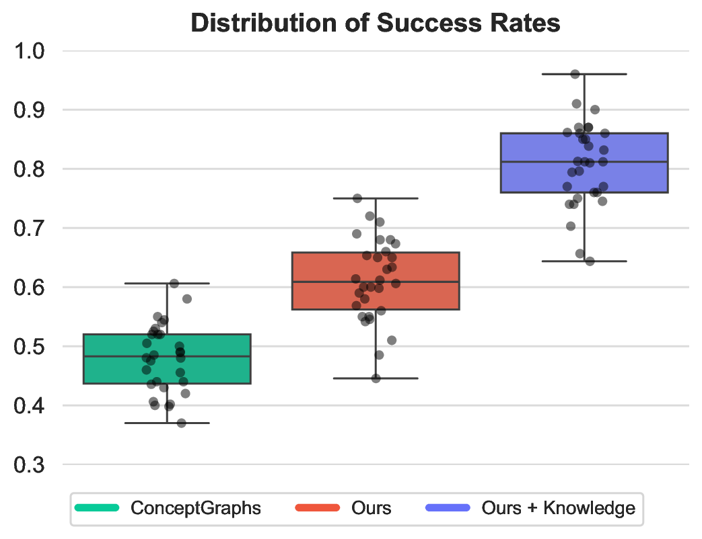
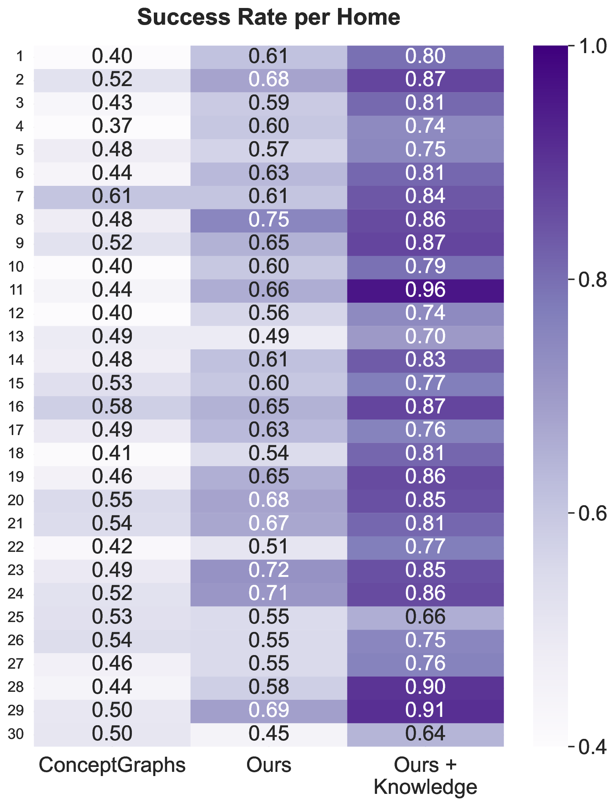

- **Interaction System**:  
    - *Success rate* increased from ~0.48 (ConceptGraphs) to ~0.81 (Ours + Knowledge).
    - *Robustness*: The system gracefully handled ambiguous, indirect, and follow-up queries, and admitted ignorance for non-existent objects.
    - *Knowledge Injection*: Users could add missing objects via natural language, further improving interaction outcomes.

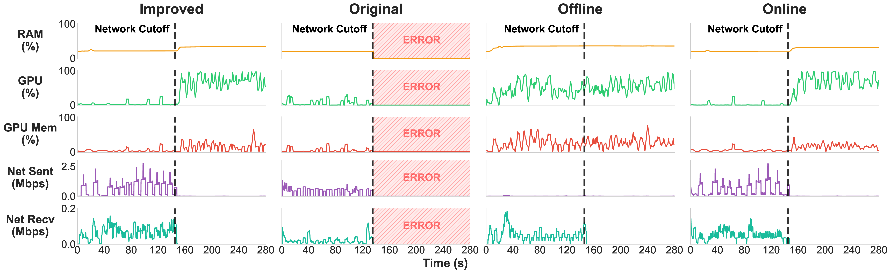

- **System Robustness**:  
    - The hybrid inference mechanism ensured uninterrupted operation during network failures by switching to local models, unlike the original system which failed on disconnection.

---

## Key Contributions

- **Room-aware semantic mapping** with robust filtering and segmentation.
- **Hybrid inference** for operational resilience and cost efficiency.
- **Advanced HITL interaction** via RAG and vector databases, supporting complex queries and runtime knowledge addition.
- **Comprehensive validation** on a large-scale simulated home dataset, demonstrating significant improvements in mapping accuracy, interaction quality, and system robustness.


## Installation

### Code

Interactive ConceptGraphs is developed in Python. We recommend using [Miniconda](https://www.anaconda.com/docs/getting-started/miniconda/) to manage your Python environment.

To create the Python environment, run the following commands:

```bash
# Create the conda environment
conda create -n interactivecg python=3.10
conda activate interactivecg
pip install uv

##### Install Torch with Cuda
uv pip install --pre torch torchvision torchaudio --index-url https://download.pytorch.org/whl/nightly/cu128

#### Install Pytorch3D
git clone https://github.com/facebookresearch/pytorch3d.git
cd pytorch3d
uv pip install -e . --no-build-isolation

#### Install dependencies
uv pip install tyro open_clip_torch wandb h5py openai hydra-core distinctipy ultralytics dill supervision open3d imageio natsort kornia rerun-sdk pyliblzfse pypng git+https://github.com/ultralytics/CLIP.git

#### Install additional requirements
uv pip install -r requirements.txt
```

### Datasets

You can find the collected dataset in the following folder: [Drive](https://drive.google.com/drive/folders/10whh0C3DFqe86hF_xEIUDGo1NJqrthK8?usp=sharing)

## Usage

### 0. Set Paths and Change .env
Before executing the script, modify the data path. Some scripts require the data path to be changed prior to execution. Failure to do so will result in an error similar to this:
```bash
    base_dataset_path = THIS PATH MUST POINT TO THE OUTPUT FOLDER OF THE MAPPING PROCESS
                             ^^^^
SyntaxError: invalid syntax
```

You need to set up your API keys in the `.env.example` file. First, rename `.env.example` to `.env`, and then add the keys.

### 1. Environment Mapping with ConceptGraphs

The main script for environment mapping is `rerun_realtime_mapping.py`. It performs detections, builds the scene graph, and saves the results.

**Steps to run the mapping:**

1. Edit the YAML configuration files in `./conceptgraph/hydra_configs/` as needed, especially data paths and execution parameters.
2. Run the script from the `conceptgraph` directory:

```bash
cd /path/to/code/concept-graphs/conceptgraph/
python slam/rerun_realtime_mapping.py
```

Results will be saved in the dataset folder under `exps`, named according to the `exp_suffix` defined in the configuration. A `config_params.json` file will also be saved for reproducibility.

### 2. Intelligent Interaction System

To interact with the mapped environment using the new interaction system, use the `system.py` script. It provides a console-based interactive interface, allowing semantic queries and map navigation.

**Steps to run the interaction system:**

1. Ensure that mapping has already been performed and result files are available.
2. Configure the dataset path and other parameters at the beginning of the `system.py` file or via environment variables.
3. Run the script:

```bash
cd /path/to/code/concept-graphs/conceptgraph/
python interaction/system.py
```

The system will open an interactive terminal interface, allowing you to navigate the map, click on positions, and ask questions about the environment.

### 3. Interactive Visualization (Legacy System)

If you prefer to use the previous ConceptGraphs visualization system, use the `visualize_cfslam_results.py` script. It allows you to explore the 3D map and perform text-based searches using CLIP.

**Example execution:**

```bash
cd /path/to/code/concept-graphs
python conceptgraph/slam/visualize_cfslam_results.py \
    --result_path /path/to/data/exps/path_to_pkl/....pkl.gz
```

#### Keyboard shortcuts in the visualization:

- Press `b` to toggle background points (wall, floor, ceiling, etc.).
- Press `c` to color points by class label.
- Press `r` to restore original RGB colors.
- Press `f` and enter text to color objects by CLIP similarity to the text.
- Press `i` to color objects by instance.