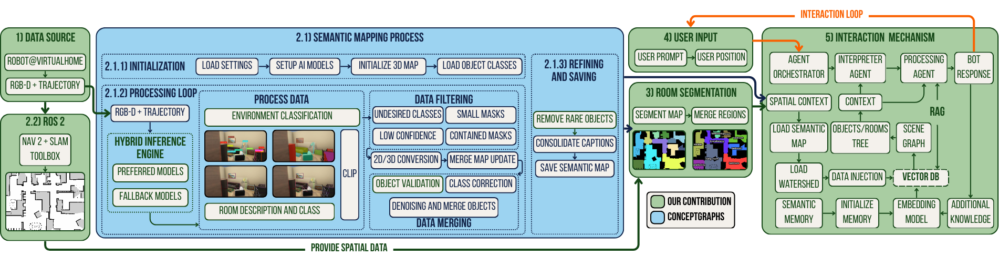

# Interactive ConceptGraphs: An Adaptable Hybrid Framework for Robust Semantic Mapping and Interaction

This repository contains the code for the Interactive ConceptGraphs project.

<!-- [**Project Page**]() |
[**Paper**]() |
[**ArXiv**]() |
[**Video**]() -->



## Installation

### Code

Interactive ConceptGraphs is developed in Python. We recommend using [Miniconda](https://www.anaconda.com/docs/getting-started/miniconda/) to manage your Python environment.

To create the Python environment, run the following commands:

```bash
# Create the conda environment
conda create -n interactivecg python=3.10
conda activate interactivecg
pip install uv

##### Install Torch with Cuda
uv pip install --pre torch torchvision torchaudio --index-url https://download.pytorch.org/whl/nightly/cu128

#### Install Pytorch3D
git clone https://github.com/facebookresearch/pytorch3d.git
cd pytorch3d
uv pip install -e . --no-build-isolation

#### Install dependencies
uv pip install tyro open_clip_torch wandb h5py openai hydra-core distinctipy ultralytics dill supervision open3d imageio natsort kornia rerun-sdk pyliblzfse pypng git+https://github.com/ultralytics/CLIP.git

#### Install additional requirements
uv pip install -r requirements.txt
```

### Datasets

You can find the collected dataset in the following folder: [Drive](https://drive.google.com/drive/folders/10whh0C3DFqe86hF_xEIUDGo1NJqrthK8?usp=sharing)

## Usage

### 0. Set Paths and Change .env
Before executing the script, modify the data path. Some scripts require the data path to be changed prior to execution. Failure to do so will result in an error similar to this:
```bash
    base_dataset_path = THIS PATH MUST POINT TO THE OUTPUT FOLDER OF THE MAPPING PROCESS
                             ^^^^
SyntaxError: invalid syntax
```

You need to set up your API keys in the `.env.example` file. First, rename `.env.example` to `.env`, and then add the keys.

### 1. Environment Mapping with ConceptGraphs

The main script for environment mapping is `rerun_realtime_mapping.py`. It performs detections, builds the scene graph, and saves the results.

**Steps to run the mapping:**

1. Edit the YAML configuration files in `./conceptgraph/hydra_configs/` as needed, especially data paths and execution parameters.
2. Run the script from the `conceptgraph` directory:

```bash
cd /path/to/code/concept-graphs/conceptgraph/
python slam/rerun_realtime_mapping.py
```

Results will be saved in the dataset folder under `exps`, named according to the `exp_suffix` defined in the configuration. A `config_params.json` file will also be saved for reproducibility.

### 2. Intelligent Interaction System

To interact with the mapped environment using the new interaction system, use the `system.py` script. It provides a console-based interactive interface, allowing semantic queries and map navigation.

**Steps to run the interaction system:**

1. Ensure that mapping has already been performed and result files are available.
2. Configure the dataset path and other parameters at the beginning of the `system.py` file or via environment variables.
3. Run the script:

```bash
cd /path/to/code/concept-graphs/conceptgraph/
python interaction/system.py
```

The system will open an interactive terminal interface, allowing you to navigate the map, click on positions, and ask questions about the environment.

### 3. Interactive Visualization (Legacy System)

If you prefer to use the previous ConceptGraphs visualization system, use the `visualize_cfslam_results.py` script. It allows you to explore the 3D map and perform text-based searches using CLIP.

**Example execution:**

```bash
cd /path/to/code/concept-graphs
python conceptgraph/slam/visualize_cfslam_results.py \
    --result_path /path/to/data/exps/path_to_pkl/....pkl.gz
```

#### Keyboard shortcuts in the visualization:

- Press `b` to toggle background points (wall, floor, ceiling, etc.).
- Press `c` to color points by class label.
- Press `r` to restore original RGB colors.
- Press `f` and enter text to color objects by CLIP similarity to the text.
- Press `i` to color objects by instance.